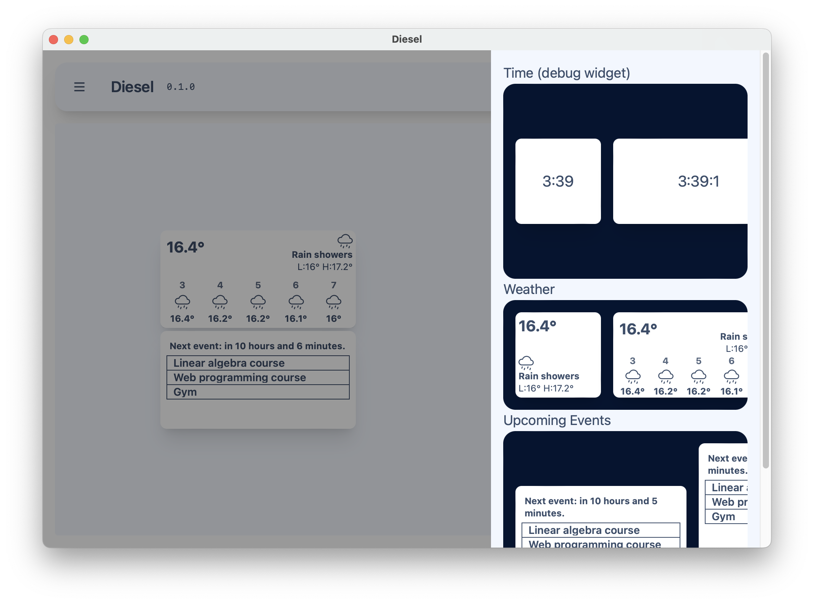
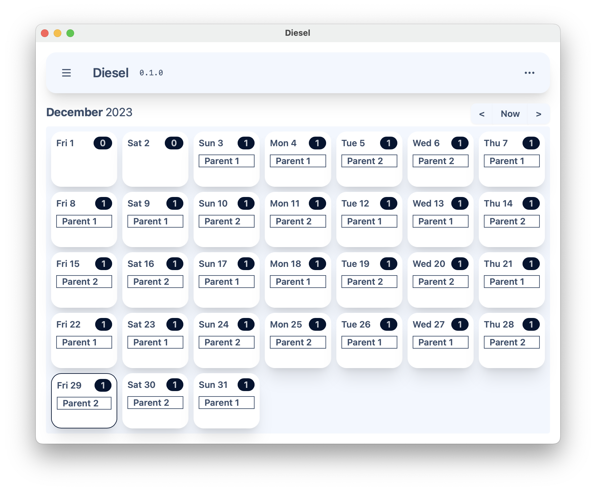
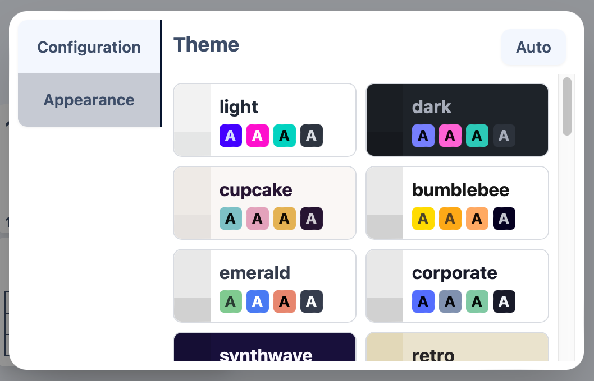

# Diesel



## Language
### Schedule model
Diesel's model of a schedule is an aggregate of events where each occurrence of an event is determined by its predicate - a mapping from a date to either true or false, true meaning the event occurs on that date.

### Examples
#### Parenting schedule
Parent 1:
```
(date >= 2023-12-03) & (
  (
      (nw(2023-12-03, date) % 2 = 0)
        & ((wd = sun) | (wd = mon) | (wd = thu) | (wd = fri) | (wd = sat))
  )
  | (
      (nw(2023-12-3, date) % 2 = 1)
        & ((wd = tue) | (wd = wed))
  )
)
```
Parent 2:
```
(date >= 2023-12-03) & (
  (
      (nw(2023-12-03, date) % 2 = 0)
        & !((wd = sun) | (wd = mon) | (wd = thu) | (wd = fri) | (wd = sat))
  )
  | (
      (nw(2023-12-3, date) % 2 = 1)
        & !((wd = tue) | (wd = wed))
  )
)
```
Result:


### Cheat sheet

#### Placeholder units

For a predicate to be evaluated, it must be given some context - a date. There are 5 **placeholder units** that can show up in a predicate, such that on evaluation they are subsituted with their value from the given context:

| Placeholder Unit | Meaning                    |
|------------------|----------------------------|
| `wd`             | Weekday (Sunday..Saturday) |
| `md`             | Month day (1..31)          |
| `mo`             | Month (January..December)  |
| `y`              | Year                       |
| `date`           | Date                       |

#### Expressions

The language defines an expression to be either a:

- Boolean
- Number (`u32`)
- Placeholder unit
- Weekday (`sun`, `mon`, `tue`, `wed`, `thu`, `fri`, `sat`)
- Month (`jan`, `feb`, `mar`, `apr`, `may`, `jun`, `jul`, `aug`, `sep`, `oct`, `nov`, `dec`)
- Date (`YYYY-MM-DD`)
- Predicate
    - Equality (`e1 = e2`)
    - Logical AND (`e1 & e2`)
    - Logical OR (`e1 | e2`)
    - Logical NOT (`!e1`)
    - Order comparison (`e1 < e2`, `e1 <= e2`, `e1 > e2`, `e1 >= e2`, can be applied to numbers and dates)
- Arithmetic
    - Addition (`e1 + e2`, addition between a date and a number N is the date + N days)
    - Modulo (`e1 % e2`)
- Functions (discussed next)

#### Built-in functions

| Function | Parameters        | Output                                             |
|----------|-------------------|----------------------------------------------------|
| `md`     | `date`            | Month day of `date`                                |
| `wd`     | `date`            | Weekday of `date`                                  |
| `wdp`    | `weekday`, `date` | The date of the previous `weekday`                 |
| `nw`     | `date`, `date`    | The number of weeks in the span of the given dates |

## Preview
### Settings → Appearance
Diesel offers a variety of themes (32) provided by daisyUI:


## Building from source
Install the following dependencies and build the project using `cargo build`.

### Dependencies
- Tailwind (+ typography) CSS (`npm i -D tailwindcss @tailwindcss/typography`)
- daisyUI (`npm i -D daisyui@latest`)

## Dedication

In loving memory of
